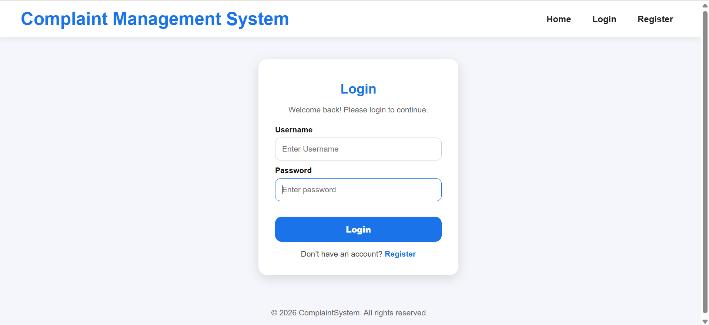
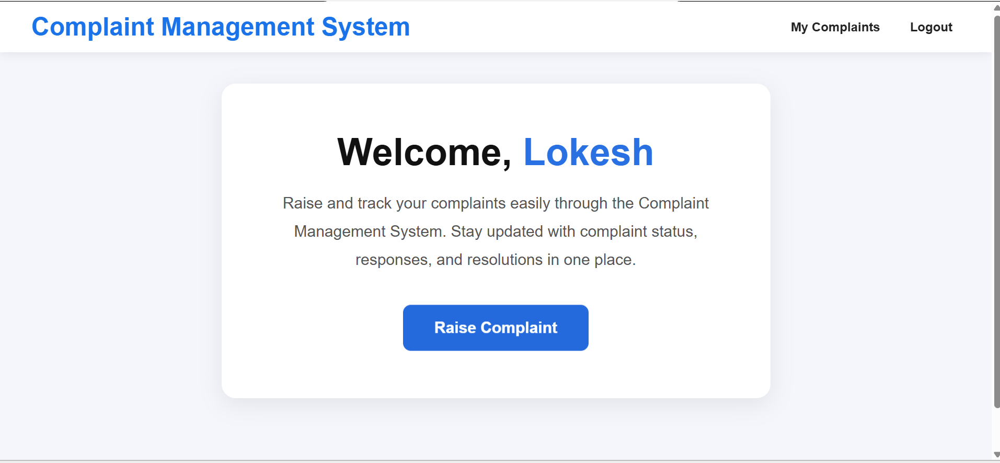
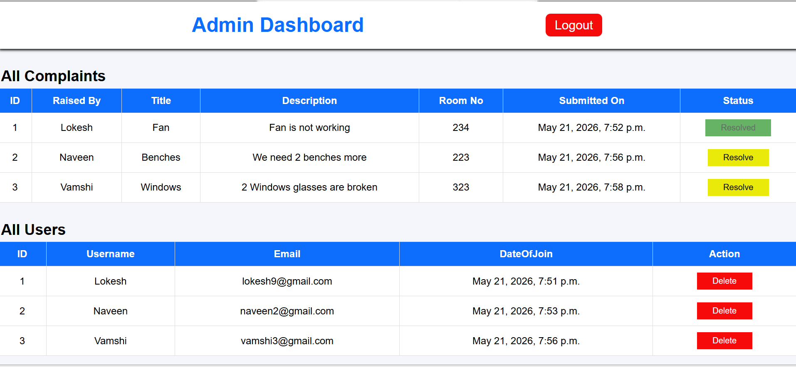
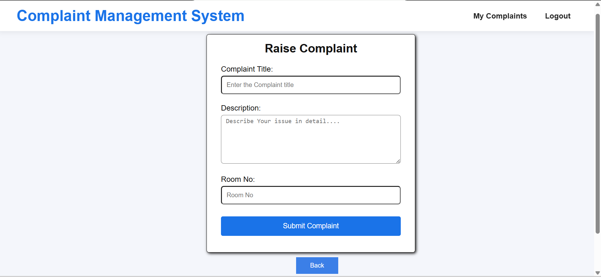

# Complaint Management System

A role-based complaint management platform built using Django and Django REST Framework that enables users to register and track complaints while allowing administrators to manage, update, and resolve complaints through secure REST APIs and dashboard workflows.

## Features

- JWT-based authentication and authorization
- Role-Based Access Control (Admin/User)
- Complaint creation and tracking system
- Complaint status management workflow
- Admin dashboard for complaint monitoring
- User dashboard for complaint management
- REST API integration using Django REST Framework
- Secure API endpoints and protected routes
- Deployment-ready backend configuration

## Tech Stack

### Backend
- Django
- Django REST Framework
- JWT Authentication

### Frontend
- HTML
- CSS
- JavaScript

### Database
- SQLite

### Tools
- Git
- GitHub

## Project Structure

```bash
Complaint-Management-System/
│
├── complaints/
├── users/
├── templates/
├── static/
├── screenshots/
├── manage.py
├── requirements.txt
└── README.md

## Project Setup

### Clone Repository

```bash
git clone https://github.com/MangaLokesh/Complaint-Management-System.git
cd Complaint-Management-System
python -m venv env
env\Scripts\activate
source env/bin/activate
pip install -r requirements.txt
python manage.py migrate
python manage.py runserver
Open:http://127.0.0.1:8000/

## API Endpoints

### Authentication APIs

| Method | Endpoint | Description |
|--------|----------|-------------|
| POST | `/api/register/` | Register a new user |
| POST | `/api/login/` | Authenticate user and return JWT token |

---

### User APIs

| Method | Endpoint | Description |
|--------|----------|-------------|
| POST | `/api/complaints/create/` | Create a new complaint |
| GET | `/api/my-complaints/` | Get logged-in user complaints |

---

### Admin APIs

| Method | Endpoint | Description |
|--------|----------|-------------|
| GET | `/api/admin/complaints/` | Get all complaints |
| PUT | `/api/admin/complaints/<id>/` | Update complaint status |

## Screenshots

### Login Page


---

### User Dashboard


---

### Admin Dashboard


---

### Complaint Creation Page


---
## Future Improvements

- File upload support for complaints
- Pagination and advanced filtering
- Email notification system
- PostgreSQL integration
- Complaint analytics dashboard

---
## Author
**Manga Lokesh**

